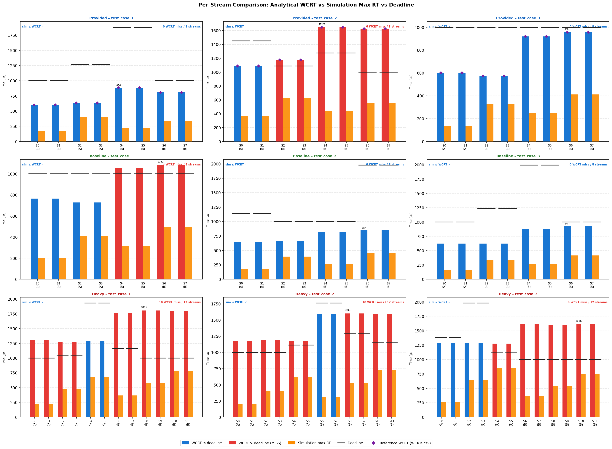
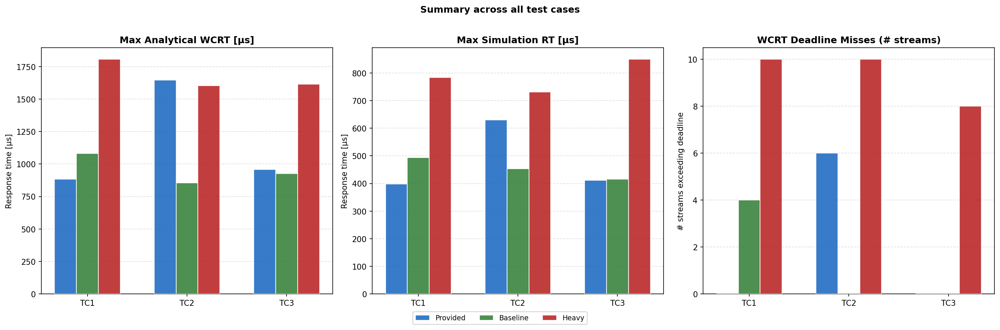

# Report Figures

This folder contains the two figures used in the project report for 02225 DRTS Mini-project 2, both generated by `plot_comparison.py`.

---

## How to generate the figures

From the root of the repository:

```bash
python3 plot_comparison.py
```

The script loads the test-case input files (`topology.json`, `streams.json`, `routes.json`) for all 9 test cases (3 categories × 3 cases), computes the analytical WCRT for each AVB stream using `src/analysis.py`, and saves both figures.

---

## `fig_per_stream.png` – Per-stream results



This is a 3×3 grid of bar charts — one chart per test case.

- **Rows** represent the three test-case categories: Provided, Baseline generated, and Heavy generated.
- **Columns** represent test_case_1, test_case_2, and test_case_3.
- Each bar group is one AVB stream (Class A or Class B).

Each chart shows three things per stream:

| Element | Meaning |
|---|---|
| **Blue bar** | Analytical WCRT — stream is within its deadline |
| **Red bar** | Analytical WCRT — stream exceeds its deadline (MISS) |
| **Orange bar** | Maximum response time observed in the simulation |
| **Black horizontal line** | Stream deadline |
| **Purple diamond** | Reference WCRT from `WCRTs.csv` (provided cases only) |

The top-right corner of each chart shows how many streams missed their deadline out of the total.

**What this shows:**
- In the **provided cases**, test_case_1 (top-left) has 0 misses. The simulation max RT (orange) is always below the analytical WCRT (blue/red), which confirms the bound is correct and the simulator is consistent with the analysis.
- In the **baseline cases**, the traffic load is light — most streams are within their deadlines.
- In the **heavy cases**, Class A and B stream counts and frame sizes are increased. This pushes many streams above their deadlines (up to 10 misses out of 12 streams). Even so, the orange bars remain below the analytical WCRT bars, showing the bound still holds.

---

## `fig_summary.png` – Summary across all test cases



This figure gives a high-level overview of the results across all 9 test cases using three grouped bar charts. Each chart groups the three test cases (TC1, TC2, TC3) on the x-axis, with one bar per category (blue = Provided, green = Baseline, red = Heavy).

| Panel | What it shows |
|---|---|
| **Max Analytical WCRT [µs]** | The highest analytical WCRT among all streams in each test case. Heavy cases reach ~1600–1800 µs. |
| **Max Simulation RT [µs]** | The highest response time actually measured in the simulation. Always lower than the analytical WCRT. |
| **WCRT Deadline Misses** | How many streams have an analytical WCRT above their deadline. Heavy cases have up to 10 misses. |

**What this shows:**
- The heavy cases consistently have the highest latencies and the most deadline misses, as expected from the increased traffic load.
- The simulation max RT is always below the analytical WCRT across every test case and category, confirming the analytical bound is a safe upper bound.
- The baseline cases generally perform better than the provided cases on latency, because the generated topology uses a fast 1 Gbps inter-switch link that reduces congestion.
